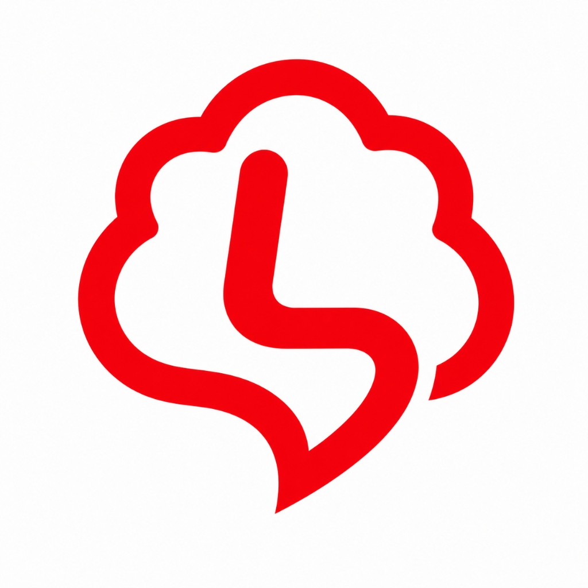

# Loomind — Agentic RAG Platform

<p align="center">
  
</p>

<p align="center">
  An enterprise-grade, agentic Retrieval-Augmented Generation (RAG) platform built for intelligent document Q&A with dynamic chunking, semantic reranking, and Redis-backed caching.
</p>

---

## Features

### Intelligent Ingestion
- **Agentic Chunking** — On upload, document text is sampled and sent to Gemini 2.5 Flash which classifies the document (`NARRATIVE`, `CODE`, `FINANCIAL_TABULAR`, `SHORT_FORM`) and dynamically selects the optimal `chunk_size` and `overlap` for that document type
- **Page-Level Metadata** — PyPDF extracts per-page metadata stored in Postgres JSONB for precise citations
- **Multi-format Support** — PDF, images, spreadsheets, and text documents, organized by category tabs

### Advanced Retrieval
- **Per-Document Fair Sampling** — Fetches top-K chunks from *each* document individually before merging, preventing large documents (e.g. 300-page reports) from drowning out small ones (e.g. a resume)
- **FlashRank Cross-Encoder Reranking** — Over-fetched candidates are reranked locally using `ms-marco-TinyBERT-L-2-v2` for genuine semantic relevance, not just vector proximity
- **Cosine Similarity** — Uses `pgvector`'s `<=>` cosine distance operator for semantically accurate embedding search
- **Redis Caching** — Exact query results are cached in Redis with a 15-minute TTL, eliminating redundant vector DB calls for repeated questions

### LLM-Declared Citations
- The LLM is instructed to append `[[USED:1,3]]` source indices at the end of each answer
- Only sources the model explicitly used are surfaced in the UI — irrelevant retrieved chunks are hidden
- Citations show as a **"View Sources" hover button** with a popover listing `filename • Page N`

### Streaming UI
- Word-by-word response streaming with immediate HTTP flush (bytes, not strings)
- Animated `Searching in database...` overlay with bouncing dots while retrieval runs
- AI-generated thread titles (2–4 words) via Gemini on first message
- Manual thread rename with pencil icon

---

## Architecture

```
┌──────────────────────────────────────────────────────────┐
│                        Frontend                           │
│   Next.js 15 · Tailwind v4 · Framer Motion · React MD   │
└──────────────────────┬───────────────────────────────────┘
                       │ HTTP / StreamingResponse
┌──────────────────────▼───────────────────────────────────┐
│                     Backend (FastAPI)                     │
│                                                           │
│  ┌─────────────┐   ┌──────────────┐   ┌───────────────┐  │
│  │  Ingestion  │   │  Retrieval   │   │  Generation   │  │
│  │             │   │              │   │               │  │
│  │ Gemini      │   │ PGVector     │   │ Gemini 2.5    │  │
│  │ Doc-Type    │   │ Cosine Sim   │   │ Flash         │  │
│  │ Classifier  │   │ + FlashRank  │   │ (streaming)   │  │
│  │             │   │ + Redis      │   │               │  │
│  └─────────────┘   └──────────────┘   └───────────────┘  │
└──────────────────────────────────────────────────────────┘
                       │
┌──────────────────────▼───────────────────────────────────┐
│                    Infrastructure                         │
│   PostgreSQL + pgvector · Redis 7 · Google Cloud Storage  │
└──────────────────────────────────────────────────────────┘
```

---

## Stack

| Layer | Technology |
|-------|-----------|
| Frontend | Next.js 15, Tailwind CSS v4, Framer Motion |
| Backend | FastAPI, LangGraph, LangChain |
| LLM | Google Gemini 2.5 Flash |
| Embeddings | `sentence-transformers/all-MiniLM-L6-v2` |
| Vector DB | PostgreSQL + pgvector |
| Reranker | FlashRank (`ms-marco-TinyBERT-L-2-v2`) |
| Cache | Redis 7 |
| Storage | Google Cloud Storage (+ local emulator) |
| Auth | Firebase (mock SSO in dev) |

---

## Getting Started

### Prerequisites
- Docker Desktop
- Google API Key (Gemini)

### Run Locally

```bash
# Clone
git clone https://github.com/beingcrazyy/RAG-Agent.git
cd RAG-Agent

# Set your API key in docker-compose.yml under backend > environment
# GOOGLE_API_KEY=your_key_here

# Build and start all services
docker compose build
docker compose up -d
```

| Service | URL |
|---------|-----|
| Frontend | http://localhost:3000 |
| Backend API | http://localhost:8000/docs |
| PostgreSQL | localhost:5432 |
| Redis | localhost:6379 |

### Run Migrations

```bash
docker compose exec backend alembic upgrade head
```

---

## Project Structure

```
RAG-Agent/
├── backend/
│   ├── src/
│   │   ├── api/          # FastAPI routes (chat, documents)
│   │   ├── models/       # SQLAlchemy ORM models
│   │   ├── services/
│   │   │   ├── rag_ingestion.py          # Agentic chunker
│   │   │   ├── langgraph_orchestrator.py # Retrieval + reranking
│   │   │   └── storage.py               # GCS integration
│   │   ├── core/         # Auth, config
│   │   └── db/           # Session, base
│   └── requirements.txt
├── frontend/
│   └── src/
│       ├── app/          # Next.js app router
│       └── components/   # Sidebar, Chat, Documents
└── docker-compose.yml
```

---

## License

MIT
